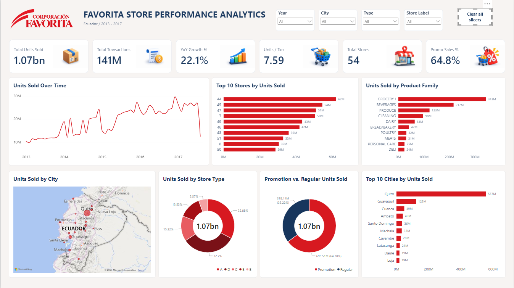

# Favorita Store Performance Analytics

## Overview

This project analyzes retail store performance using the **Corporación Favorita Store Sales** dataset from Ecuador.

The objective is to transform a large retail dataset into clear and meaningful business information using **Power BI, DAX, data modeling, and data visualization**.

The dashboard provides an interactive overview of:

- Overall unit sales and transaction activity
- Sales evolution over time
- Year-over-year performance
- Store and city performance
- Product family performance
- Store type distribution
- Promotion vs. regular sales
- Geographic performance across Ecuador

## Business Perspective

Data analytics is not only about building dashboards.

The real objective is to understand the business question, identify the relevant information, analyze the data, and communicate the results clearly.

This project was developed with that principle in mind:

> **We are not dashboard makers. We are problem solvers.**

The dashboard is therefore designed to focus on business questions rather than visual complexity.

## Dashboard

## Tools & Skills

- Power BI
- DAX
- Data Modeling
- Data Visualization
- Business Analysis
- Data Analysis

## Dataset

**Source:** Corporación Favorita — Store Sales dataset  
**Country:** Ecuador  
**Period:** 2013–2017  
**Original dataset:** Kaggle — Store Sales: Time Series Forecasting

The original dataset is not included in this repository.

## Project Objective

The purpose of this project is to demonstrate how retail data can be transformed into a structured analytical solution that helps identify trends, compare performance, and communicate relevant business information.

---

**Independent Data Analytics Portfolio Project**
